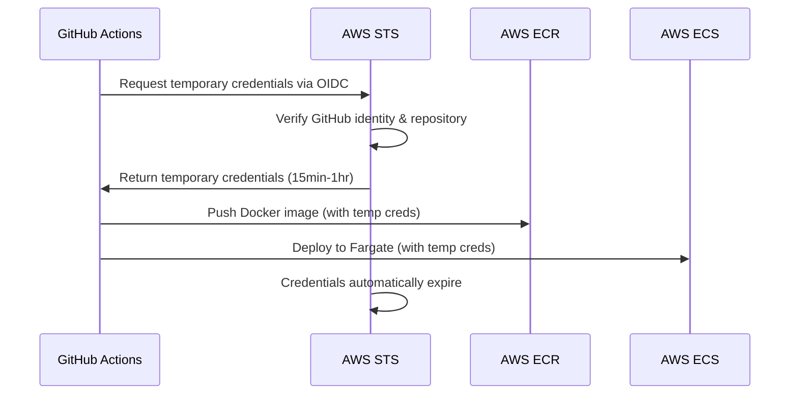

# 🔒 GitHub Actions OIDC Setup for TimmyBot

**The SECURE way to deploy TimmyBot to AWS - No stored credentials!**

## 🚀 Why OIDC is Better Than Access Keys

| **OIDC Roles** (✅ Recommended) | **Access Keys** (❌ Legacy) |
|---------------------------|------------------------|
| ✅ **No stored credentials** in GitHub | ❌ Long-lived keys stored in secrets |
| ✅ **Temporary tokens** (auto-expire) | ❌ Permanent credentials |
| ✅ **Granular permissions** per repository | ❌ Broad IAM user permissions |
| ✅ **Better audit trail** (CloudTrail) | ❌ Less detailed logging |
| ✅ **Automatic rotation** | ❌ Manual key rotation needed |
| ✅ **Follows AWS best practices** | ❌ Discouraged by AWS |

---

## 🔧 Setup Process

### **Step 1: Run the OIDC Setup Script**

We've automated the entire AWS configuration for you:

```bash
# Make script executable
chmod +x scripts/setup-github-oidc-role.sh

# Run the setup (requires AWS CLI with admin permissions)
./scripts/setup-github-oidc-role.sh
```

**What the script does:**
1. ✅ Creates/verifies GitHub OIDC Identity Provider in AWS
2. ✅ Creates IAM role: `GitHubActions-TimmyBot-Role`
3. ✅ Sets up trust relationship for your repository: `iddv/TimmyBot`
4. ✅ Attaches granular permissions for:
   - ECR (push/pull Docker images)
   - ECS (deploy to Fargate)
   - Secrets Manager (read bot tokens)
   - CloudWatch Logs (deployment logging)
5. ✅ Outputs the Role ARN for GitHub configuration

### **Step 2: Add Role ARN to GitHub Secrets**

After the script completes, it will output something like:

```
Role ARN to add to GitHub Secrets:
arn:aws:iam::123456789012:role/GitHubActions-TimmyBot-Role
```

**Configure GitHub:**
1. Go to: **https://github.com/iddv/TimmyBot/settings/secrets/actions**
2. Click **"New repository secret"**
3. **Name**: `AWS_ROLE_ARN`
4. **Value**: `arn:aws:iam::YOUR-ACCOUNT:role/GitHubActions-TimmyBot-Role`
5. Click **"Add secret"**

### **Step 3: Deploy! 🚀**

That's it! Your GitHub Actions workflow is now configured to use OIDC:

```yaml
# .github/workflows/deploy.yml (already updated)
- name: 🔑 Configure AWS credentials (OIDC Role)
  uses: aws-actions/configure-aws-credentials@v4
  with:
    role-to-assume: ${{ secrets.AWS_ROLE_ARN }}
    aws-region: ${{ env.AWS_REGION }}
    role-session-name: GitHubActions-TimmyBot
```

**Next push to `master` will:**
1. ✅ Assume the IAM role via OIDC (no stored credentials!)
2. ✅ Build and test your Kotlin application  
3. ✅ Build Docker image with guild isolation architecture
4. ✅ Push to ECR with automatic versioning
5. ✅ Deploy to ECS Fargate with zero downtime
6. ✅ Verify deployment success

---

## 🔍 How OIDC Works



**Key Security Features:**
- **🔐 No secrets** stored in GitHub (only the Role ARN, which is not sensitive)
- **⏰ Temporary credentials** that expire automatically
- **🎯 Scoped permissions** - role can only access TimmyBot resources
- **🔍 Repository verification** - only your specific repo can assume the role
- **📋 Full audit trail** in AWS CloudTrail

---

## 🚨 Troubleshooting

### Common Issues:

**❌ "Credentials could not be loaded"**
- ✅ Verify `AWS_ROLE_ARN` secret is set correctly in GitHub
- ✅ Check the role ARN format: `arn:aws:iam::ACCOUNT:role/GitHubActions-TimmyBot-Role`
- ✅ Ensure the role trust policy includes your repository

**❌ "Role cannot be assumed"**
- ✅ Verify the role trust policy allows your repository: `repo:iddv/TimmyBot:*`
- ✅ Check that the OIDC provider exists in your AWS account
- ✅ Ensure the workflow has `permissions.id-token: write`

**❌ "Access denied to ECS/ECR"**
- ✅ Verify the role has the correct policies attached
- ✅ Check that resource ARNs match your actual AWS resources
- ✅ Ensure the role can pass the ECS task/execution roles

### Validation Commands:

```bash
# Check if OIDC provider exists
aws iam list-open-id-connect-providers

# Verify role exists and has correct trust policy  
aws iam get-role --role-name GitHubActions-TimmyBot-Role

# List attached policies
aws iam list-attached-role-policies --role-name GitHubActions-TimmyBot-Role
```

---

## 🎉 Benefits You'll Experience

**🚀 Faster Deployments:**
- No manual AWS CLI commands ever again
- Push to `master` → automatic deployment in ~3-5 minutes

**🔒 Better Security:**
- No long-lived credentials to rotate or secure
- Granular permissions (principle of least privilege)
- Full audit trail of who deployed what and when

**🛠️ Easier Maintenance:**
- No credential rotation needed
- Self-documenting deployment process
- Easy to troubleshoot with detailed logs

**👥 Team Collaboration:**
- Any team member can deploy by pushing to `master`
- No need to share AWS credentials
- Consistent deployment process for everyone

---

## 🔄 Migration from Access Keys

If you previously set up access keys, you can safely migrate:

1. ✅ Run the OIDC setup script
2. ✅ Add `AWS_ROLE_ARN` to GitHub secrets
3. ✅ Remove old secrets: `AWS_ACCESS_KEY_ID` and `AWS_SECRET_ACCESS_KEY`
4. ✅ Delete the old IAM user: `github-actions-timmybot`

The workflow will automatically detect and use OIDC authentication!